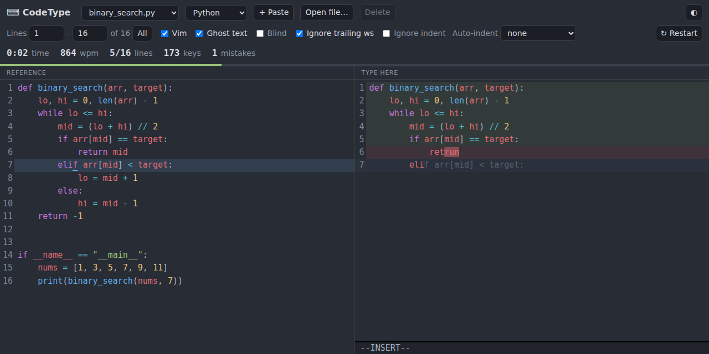

# CodeType — practice typing your own code (with Vim)

Your code on the left, an editor on the right. Type it out with real Vim motions:
`o`, `cw`, `dd`, `yyp`, `.`, macros, `:s`, visual-block `Ctrl-v` multi-line edits,
and so on. Lines go green when they match. A mistake turns red from the first
wrong character.



## Use it

**No build needed:** open `index.html` in a browser.

Ways to add code:
- **`snippets/` folder:** drop files in (any language, subfolders OK), run
  `npm install && npm run build`, and they show up under *Repo snippets*.
- **+ Paste:** paste code into the dialog. It's saved in your browser.
- **Open file… or drag & drop:** add one or more files from disk.

## Features

- **Vim mode** via [codemirror-vim](https://github.com/replit/codemirror-vim):
  normal, insert and visual modes, visual-block, `.` repeat, registers, macros,
  and ex commands such as `:s/foo/bar/g`. `:restart` starts over. Uncheck *Vim*
  to type without Vim keybindings.
- **Autocomplete:** suggestions appear as you type. They come from the language
  (Python, JavaScript/TypeScript, Go, HTML, CSS and SQL ship real ones) *and*
  from the identifiers in the snippet you're copying, which is usually exactly
  the word you want. C/C++, Java and Rust fall back to the snippet's identifiers
  plus a keyword list. **Tab** accepts, **Ctrl-Space** opens it by hand, arrows
  move, **Escape** closes it and leaves insert mode in one press.
- **Auto-close brackets:** typing `(`, `[`, `{` or a quote inserts the closing
  one; typing the closer yourself just moves over it. The line you're on is only
  checked up to your cursor, so a pending `)` to the right never shows as an
  error.
- **Multiple cursors:** Ctrl/Cmd-click, or Alt-drag for a rectangular selection.
- **Edit the reference:** click **✎ Edit** above the left pane to fix or
  trim the code you're copying. Vim works there too. Save with **Save**,
  `Ctrl+S` or `:w`, and discard with **Cancel** or `:q`. If you're practising
  a line range, only that range is replaced. Edits to files from `snippets/`
  are saved in your browser, not the file itself, and **Revert to original**
  brings the repo version back.
- **Line range:** drill one part of a long file, for example lines 40–80.
- **Ghost text:** the rest of the current line shows faintly ahead of the cursor.
- **Blind mode:** hides the reference so you type from memory. Errors still show.
- **Auto-indent:** *keep previous* (like Vim's `autoindent`), *smart* (follows
  the language) or *none* (you type every space).
- **Ignore trailing whitespace / indentation:** makes the comparison more lenient.
- **Stats:** time, WPM, keystrokes, keys per character and mistakes. Runs are
  saved per snippet and line range, so you can see your personal best.
  Keys per character below 1.0 means your Vim tricks saved you keystrokes.

Shortcuts: `Alt+R` restart · `Alt+B` blind · `Alt+G` ghost text · `Alt+A` autocomplete.

## Practice in your real Vim

To use your own `.vimrc` and plugins:

```sh
python3 vimtype.py snippets/binary_search.py          # whole file
python3 vimtype.py snippets/binary_search.py 10 40    # lines 10–40
```

Vim opens with the reference on the left (read-only) and an empty buffer on the
right, with scrolling locked together. Type the code out, then `:wqa`. You get
your time, WPM and a diff of any mismatches. It uses `nvim` if it's installed,
or set `VIMTYPE_EDITOR`.

## Development

```sh
npm install
npm run build     # bundles src/ + snippets/ into dist/app.js
npm run watch     # rebuild on change
npm test          # headless smoke test (Playwright; needs Node 20+)
```

`dist/app.js` is committed, so `index.html` works straight from a clone. A
GitHub Pages workflow is included in `.github/workflows/pages.yml`. To use it,
enable Pages with *Source: GitHub Actions* in the repo settings.
